# Chapter 1: Decision Trees

http://www.public.asu.edu/~kirkwood/DAStuff/decisiontrees/DecisionTreePrimer-1.pdf

## 1.1 Decision Trees

### Example 1.1

[open in SilverDecisions](http://www.silverdecisions.pl/SilverDecisions.html?LOAD_SD_TREE_JSON=https://raw.githubusercontent.com/leastwanted/decision_tree/master/decision_tree_primer/example_1.1.json)

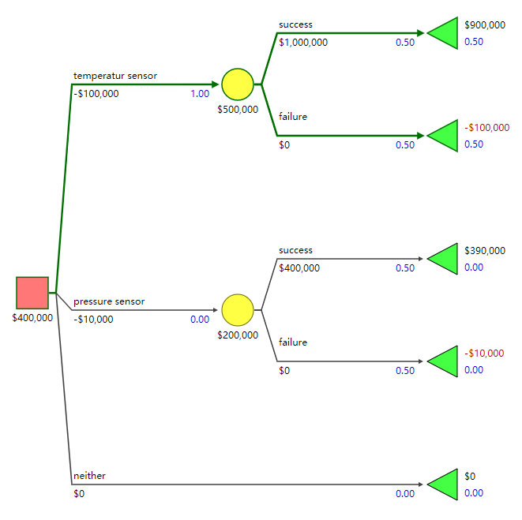

### Example 1.2

[open in SilverDecisions](http://www.silverdecisions.pl/SilverDecisions.html?LOAD_SD_TREE_JSON=https://raw.githubusercontent.com/leastwanted/decision_tree/master/decision_tree_primer/example_1.2.json)

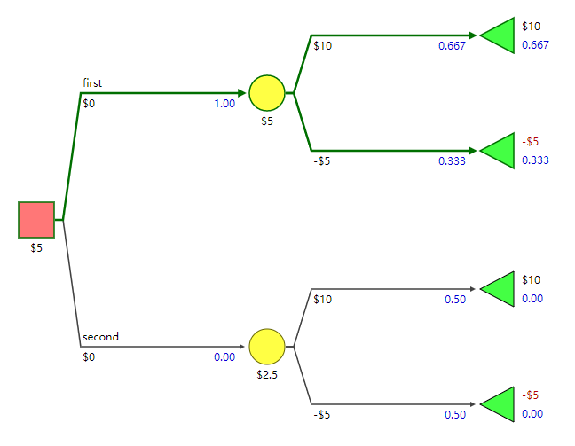

### Example 1.3

[open in SilverDecisions](http://www.silverdecisions.pl/SilverDecisions.html?LOAD_SD_TREE_JSON=https://raw.githubusercontent.com/leastwanted/decision_tree/master/decision_tree_primer/example_1.3.json)

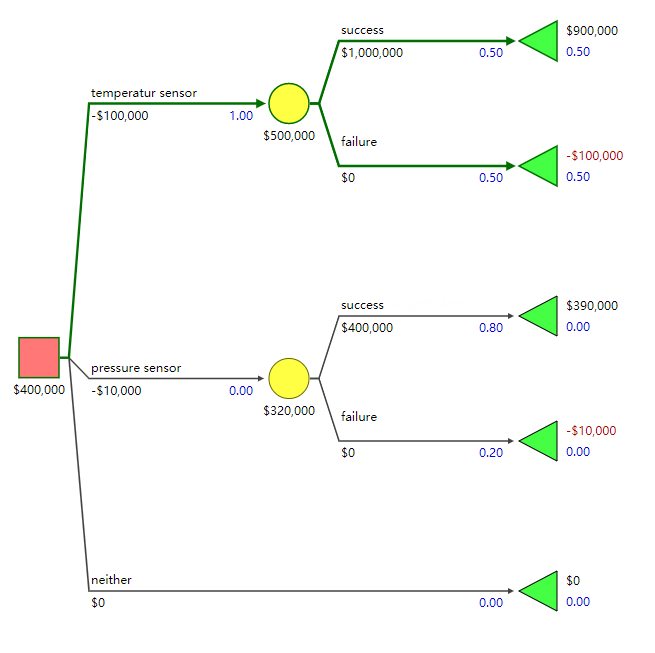

## 1.2 Expected Value

### Example 1.4

[open in SilverDecisions](http://www.silverdecisions.pl/SilverDecisions.html?LOAD_SD_TREE_JSON=https://raw.githubusercontent.com/leastwanted/decision_tree/master/decision_tree_primer/example_1.4.json)

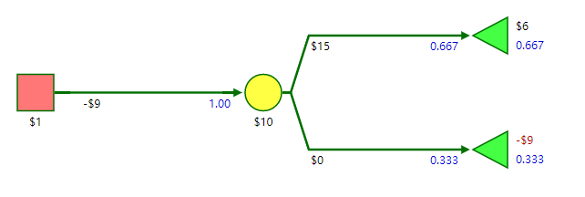

### Example 1.5

[open in SilverDecisions](http://www.silverdecisions.pl/SilverDecisions.html?LOAD_SD_TREE_JSON=https://raw.githubusercontent.com/leastwanted/decision_tree/master/decision_tree_primer/example_1.5.json)

## Xanadu Traders

### Example 1.6

[open in SilverDecisions](http://www.silverdecisions.pl/SilverDecisions.html?LOAD_SD_TREE_JSON=https://raw.githubusercontent.com/leastwanted/decision_tree/master/decision_tree_primer/example_1.6.json)

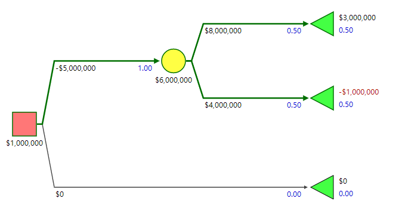

## 1.3 Dependent Uncertainties

### Example 1.7

[open in SilverDecisions](http://www.silverdecisions.pl/SilverDecisions.html?LOAD_SD_TREE_JSON=https://raw.githubusercontent.com/leastwanted/decision_tree/master/decision_tree_primer/example_1.7.json)

## 1.4 Sequential Decisions

### Example 1.8

[open in SilverDecisions](http://www.silverdecisions.pl/SilverDecisions.html?LOAD_SD_TREE_JSON=https://raw.githubusercontent.com/leastwanted/decision_tree/master/decision_tree_primer/example_1.8.json)

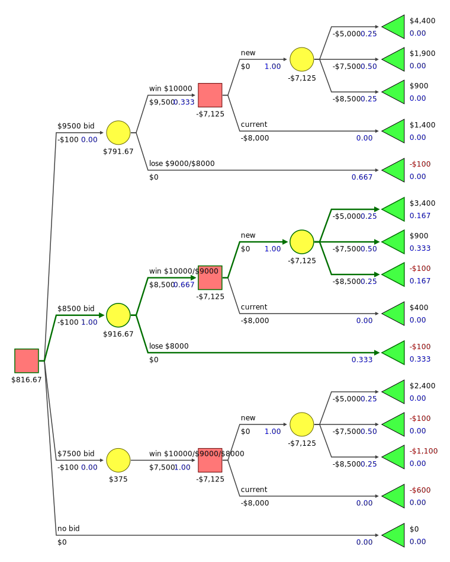

## 1.5 Exercises

### 1.1

[open in SilverDecisions](http://www.silverdecisions.pl/SilverDecisions.html?LOAD_SD_TREE_JSON=https://raw.githubusercontent.com/leastwanted/decision_tree/master/decision_tree_primer/exercise_1.1.json)

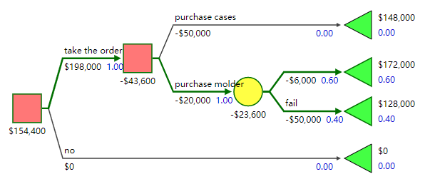

### 1.2

[open in SilverDecisions](http://www.silverdecisions.pl/SilverDecisions.html?LOAD_SD_TREE_JSON=https://raw.githubusercontent.com/leastwanted/decision_tree/master/decision_tree_primer/exercise_1.2.json)

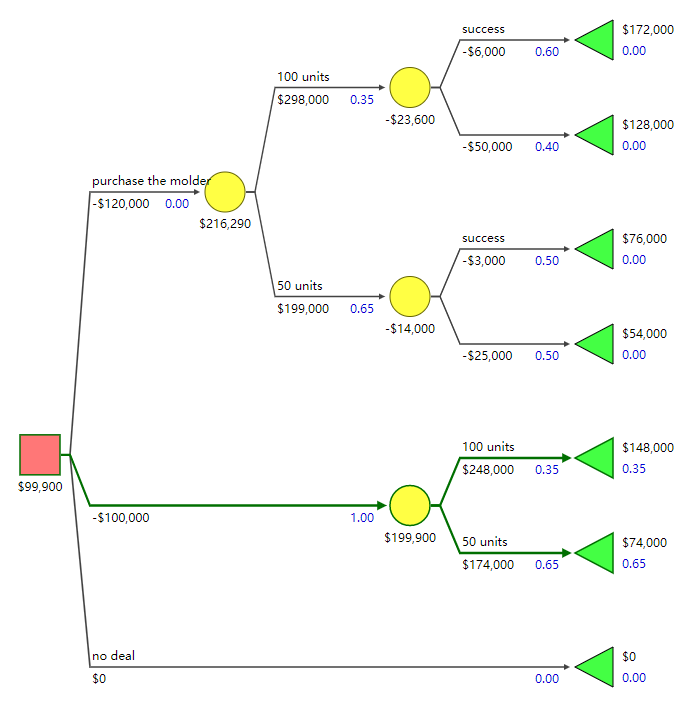

### 1.3

[open in SilverDecisions](http://www.silverdecisions.pl/SilverDecisions.html?LOAD_SD_TREE_JSON=https://raw.githubusercontent.com/leastwanted/decision_tree/master/decision_tree_primer/exercise_1.3.json)

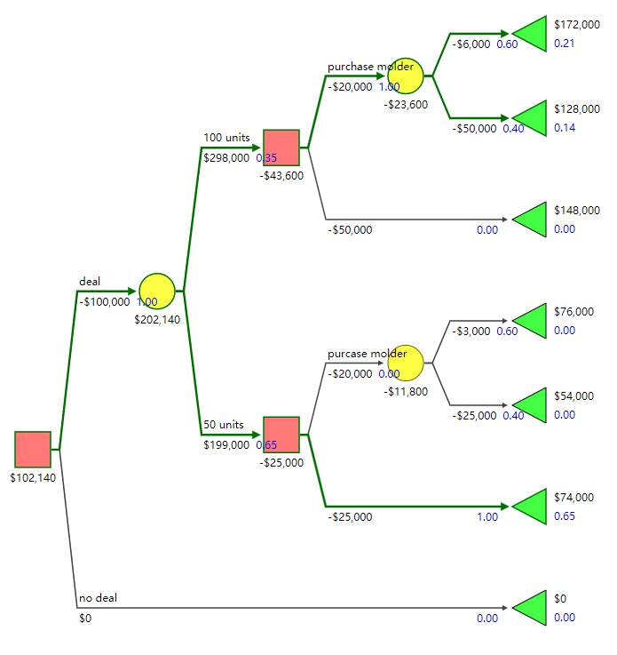

### 1.4

[open in SilverDecisions](http://www.silverdecisions.pl/SilverDecisions.html?LOAD_SD_TREE_JSON=https://raw.githubusercontent.com/leastwanted/decision_tree/master/decision_tree_primer/exercise_1.4.json)

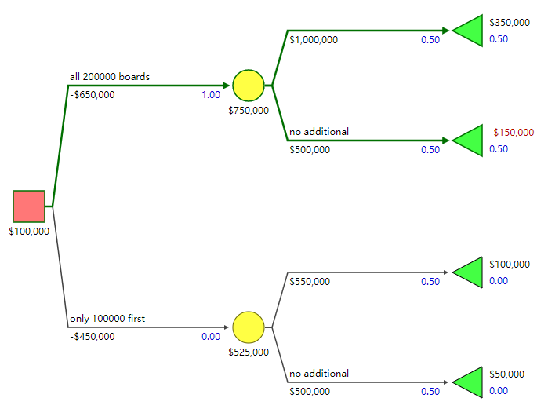

### 1.5

[open in SilverDecisions](http://www.silverdecisions.pl/SilverDecisions.html?LOAD_SD_TREE_JSON=https://raw.githubusercontent.com/leastwanted/decision_tree/master/decision_tree_primer/exercise_1.5.json)

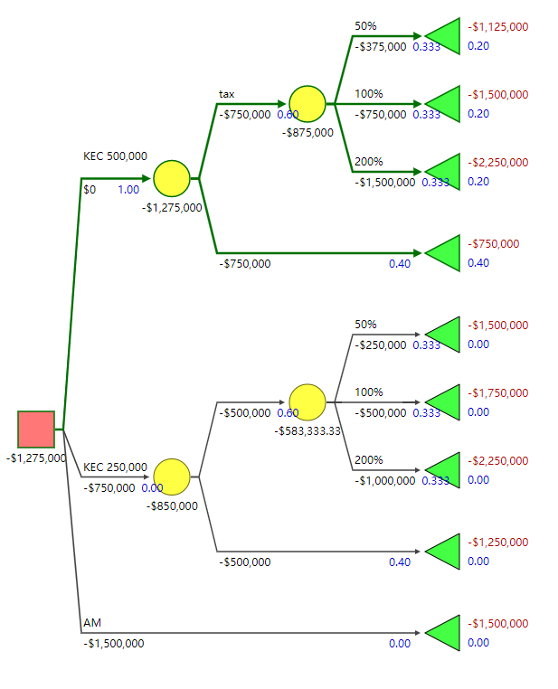

### 1.6

[open in SilverDecisions](http://www.silverdecisions.pl/SilverDecisions.html?LOAD_SD_TREE_JSON=https://raw.githubusercontent.com/leastwanted/decision_tree/master/decision_tree_primer/exercise_1.6.json)

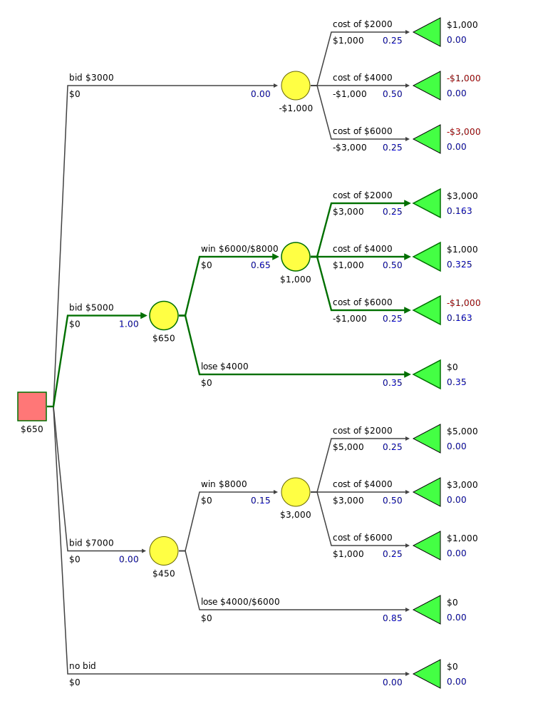
