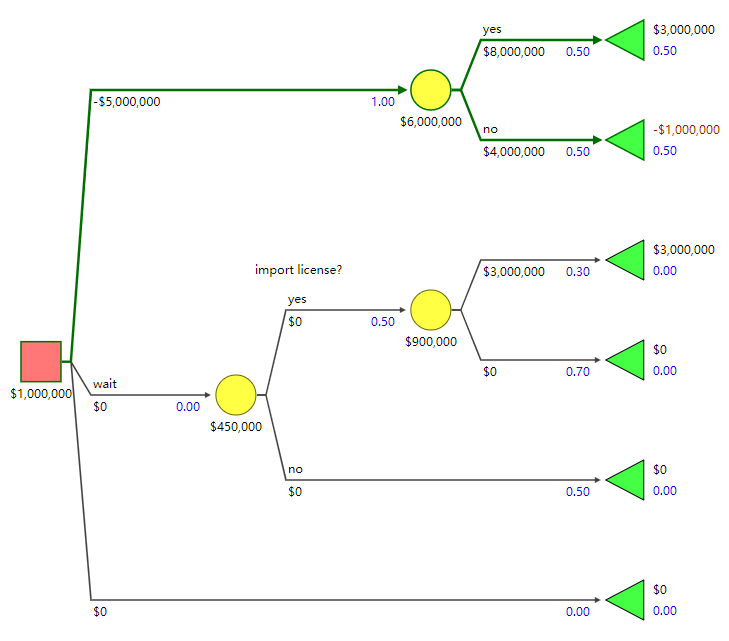

# Chapter 1: Decision Trees

http://www.public.asu.edu/~kirkwood/DAStuff/decisiontrees/DecisionTreePrimer-1.pdf

## 1.1 Decision Trees

### Example 1.1

### Example 1.2

### Example 1.3

## 1.2 Expected Value

### Example 1.4

### Example 1.5

## Xanadu Traders

### Example 1.6

## 1.3 Dependent Uncertainties

### Example 1.7

## 1.4 Sequential Decisions

### Example 1.8

## 1.5 Exercises

### 1.1

### 1.2

### 1.3

### 1.4

### 1.5

### 1.6

