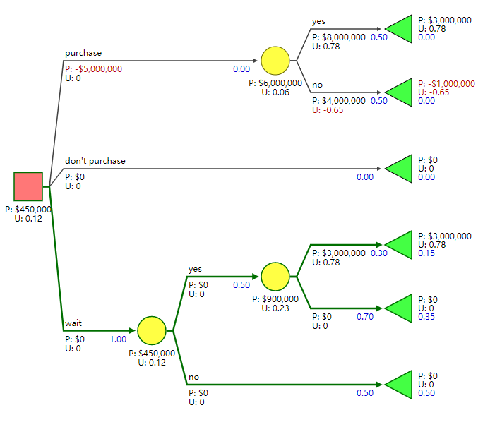
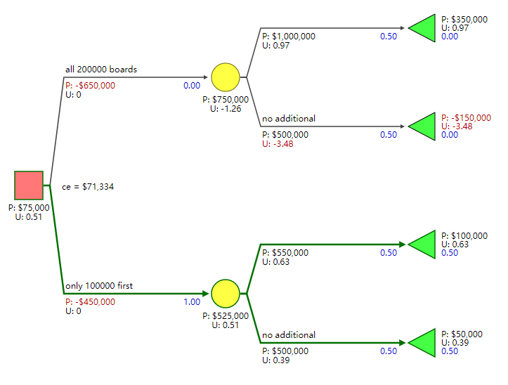
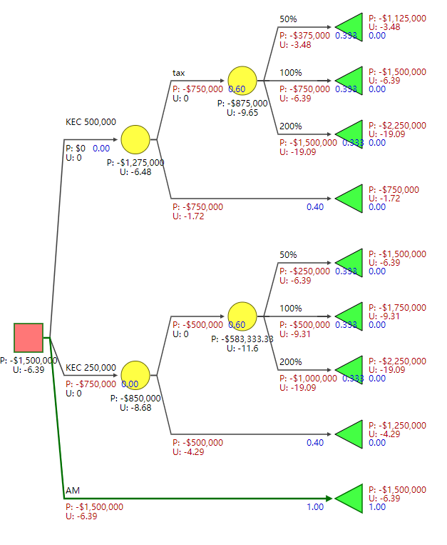
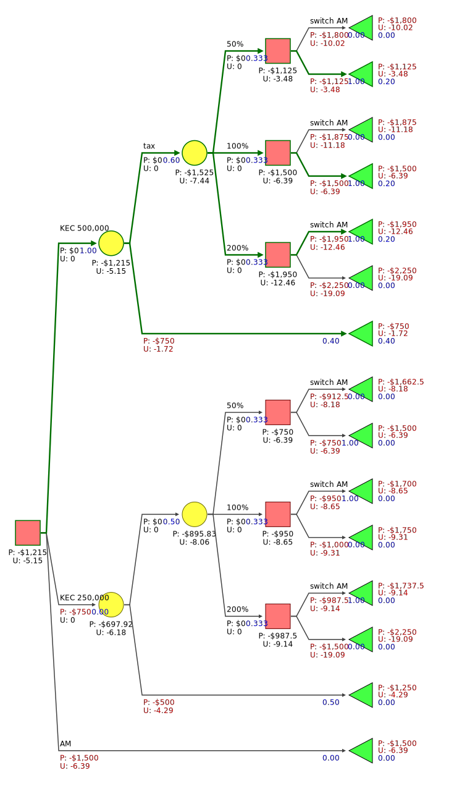

# Chapter 2 Risk Aversion

http://www.public.asu.edu/~kirkwood/DAStuff/decisiontrees/DecisionTreePrimer-2.pdf

## 2.1 Risk Attitude

### Example 2.2

[open in SilverDecisions](http://www.silverdecisions.pl/SilverDecisions.html?LOAD_SD_TREE_JSON=https://raw.githubusercontent.com/leastwanted/decision_tree/master/decision_tree_primer/example_2.2.json)

## Exercises

### 2.1

[open in SilverDecisions](http://www.silverdecisions.pl/SilverDecisions.html?LOAD_SD_TREE_JSON=https://raw.githubusercontent.com/leastwanted/decision_tree/master/decision_tree_primer/exercise_2.1.json)

### 2.2

[open in SilverDecisions](http://www.silverdecisions.pl/SilverDecisions.html?LOAD_SD_TREE_JSON=https://raw.githubusercontent.com/leastwanted/decision_tree/master/decision_tree_primer/exercise_2.2.json)

### 2.3

[open in SilverDecisions](http://www.silverdecisions.pl/SilverDecisions.html?LOAD_SD_TREE_JSON=https://raw.githubusercontent.com/leastwanted/decision_tree/master/decision_tree_primer/exercise_2.3.json)

