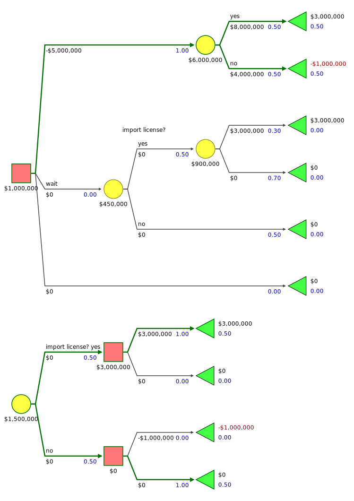
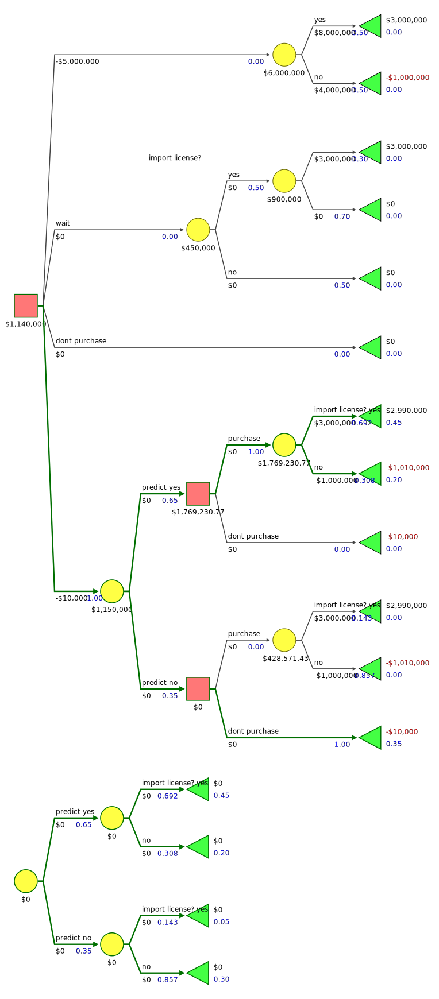
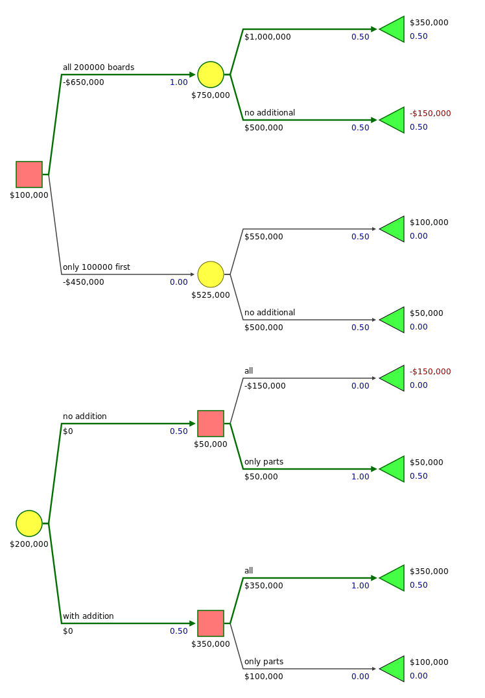
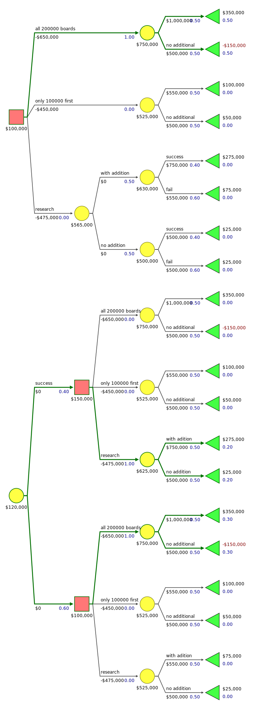
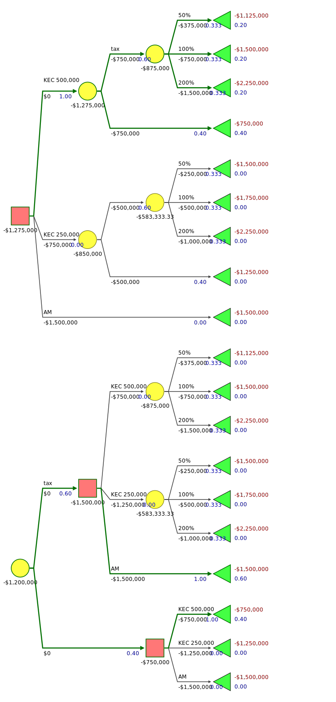
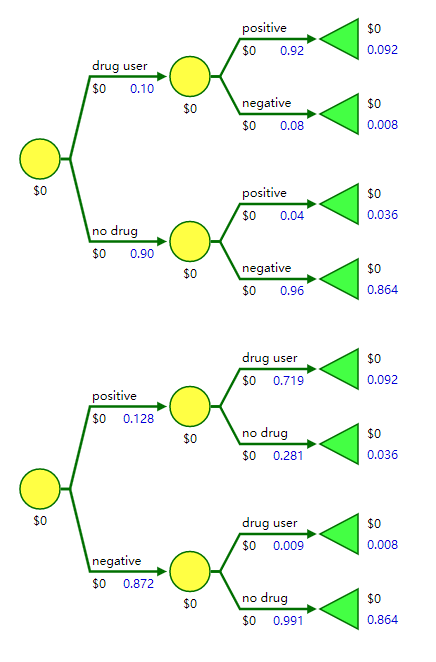
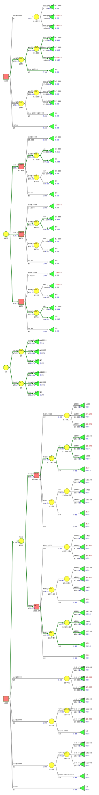

# Chapter 3 The Value of Information

## 3.1 Calculating the Value of Perfect Information

### Example 3.1

## 3.2 The Value of Imperfect Information

## Exercises

### 3.1

### 3.2

### 3.3

### 3.4

### 3.5

